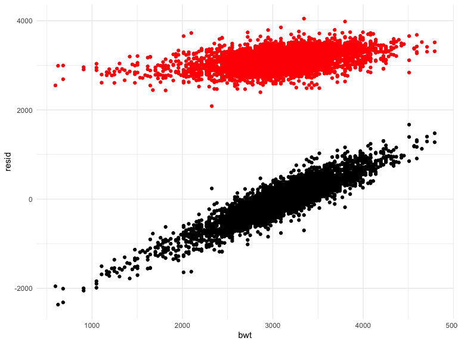

Homework 6
================
Mohammad Fouda

## Problem 2

### Data cleaning and tidying

``` r
homicide <-
  read_csv("data/homicide-data.csv") %>% 
  mutate(
      city_state = str_c(city, ", ", state),
      case = ifelse(disposition == "Closed by arrest", 1, 0),
      victim_age = as.numeric(victim_age),
      victim_race = fct_relevel(victim_race, "White", "Black"))%>% 
    filter(
        !(city_state %in% c("Dallas, TX", "Phoenix, AZ", "Kansas City, MO", "Tulsa, AL")),
        victim_race %in% c("White", "Black"))
```

    ## Rows: 52179 Columns: 12
    ## ── Column specification ────────────────────────────────────────────────────────
    ## Delimiter: ","
    ## chr (9): uid, victim_last, victim_first, victim_race, victim_age, victim_sex...
    ## dbl (3): reported_date, lat, lon
    ## 
    ## ℹ Use `spec()` to retrieve the full column specification for this data.
    ## ℹ Specify the column types or set `show_col_types = FALSE` to quiet this message.

### Regression for Baltimore, MD

We use the `glm` function to fit a logistic regression with resolved vs
unresolved as the outcome and victim age, sex and race as predictors.

##### Plotting missing vs observed values

First, we plot the missing vs. observed values in the `homicide` dataset
to visulaize the impact of missing data on the model building.

``` r
missing_plot <-
    homicide %>% 
    Amelia::missmap()
```


##### Fitting the model

To fit the model, we filter the `homicide` dataset down to the city of
Baltimore, MD. Then, we run logistic regression using `glm`. Then, we
extract the or and CI using the `logistic.dsiplay` function from the
`epiDisplay` package. The results are presented in a table using the
`knitr::kable` function.

``` r
balt_df <-
    homicide %>% 
    filter(city_state == "Baltimore, MD") 

balt_model <-
    balt_df %>% 
    glm(case ~ victim_age + victim_sex + victim_race, family = binomial, data = .) %>% 
    broom::tidy()

balt_or <- 
    glm(case ~ victim_age + victim_sex + victim_race, family = binomial, data = balt_df) %>% 
    epiDisplay::logistic.display(simplified = TRUE) %>% 
    knitr::kable(digits = 2)

balt_or
```

\|\| \|\| \|\| \|\|

|                  |   OR | lower95ci | upper95ci | Pr(\>\|Z\|) |
|:-----------------|-----:|----------:|----------:|------------:|
| victim_age       | 0.99 |      0.99 |      1.00 |        0.04 |
| victim_sexMale   | 0.43 |      0.32 |      0.56 |        0.00 |
| victim_raceBlack | 0.43 |      0.31 |      0.61 |        0.00 |

\|\| \|\| \|\| \|\|

The odds ratio for solving homicides comparing male victims to female
victims keeping all other variables fixed in Baltimore, MD is 0.43, and
the 95% confidence interval is 0.32 and 0.56.

### Regression across all cities

Next, we run `glm` for each of the cities in our dataset, and extract
the adjusted odds ratio and CI for solving homicides comparing male
victims to female victims. We utilize the functions `nest`,
`broom::tidy`, and `unnest` as necessary to ensure a tidy process and
results. The OR and CI was calculated by hand in this step.

``` r
all_cities_model <-
    homicide %>% 
    nest(df = -city_state) %>% 
    mutate(
        models = map(.x = df, ~glm(case ~ victim_age + victim_sex + victim_race, family = binomial, data = .x)),
        results = map(models, broom::tidy)) %>% 
    select(city_state, results) %>% 
    unnest(results) %>% 
    filter(term == "victim_sexMale") %>% 
    mutate(
        or = exp(estimate),
        lower95ci = exp(estimate - 1.96*std.error),
        upper95ci = exp(estimate + 1.96*std.error),
        city_state = fct_reorder(city_state, or)) %>% 
    select(city_state, or, lower95ci, upper95ci) 

all_cities_model
```

    ## # A tibble: 47 × 4
    ##    city_state         or lower95ci upper95ci
    ##    <fct>           <dbl>     <dbl>     <dbl>
    ##  1 Albuquerque, NM 1.77      0.831     3.76 
    ##  2 Atlanta, GA     1.00      0.684     1.46 
    ##  3 Baltimore, MD   0.426     0.325     0.558
    ##  4 Baton Rouge, LA 0.381     0.209     0.695
    ##  5 Birmingham, AL  0.870     0.574     1.32 
    ##  6 Boston, MA      0.674     0.356     1.28 
    ##  7 Buffalo, NY     0.521     0.290     0.935
    ##  8 Charlotte, NC   0.884     0.557     1.40 
    ##  9 Chicago, IL     0.410     0.336     0.501
    ## 10 Cincinnati, OH  0.400     0.236     0.677
    ## # … with 37 more rows

### Plotting ORs and CI

This step creates a plot that shows the estimated ORs and CIs for each
city.

``` r
model_plot <-
    all_cities_model %>% 
    ggplot(aes(x = city_state, y = or)) +
    geom_point() +
    geom_errorbar(aes(ymin = lower95ci, ymax = upper95ci), width = 0.2) +
      labs(
        title = "Homicides Esimates Across US Cities",
        x = "City",
        y = "Odds Ratio") + 
   theme(axis.text.x = element_text(angle = 90, vjust = 0.5, hjust=1)) +
    scale_y_continuous(breaks = seq(0, 5, by = 0.5))
    

model_plot
```


The plot shows that the odds of solving a homicide case of male victims
are lower compared to that of a female victim across most US cities with
the exception of Fresno, CA, Stockton, CA, and Albuquerque, NM. The odds
are approximately similar for both male and female victims in the cities
of Minneapolis, MN, Oklahoma City, OK, Tulsa, OK, Atlanta, GA, and
Richmond, VA.

## Problem 3

### Data cleaning and tidying

First, we load and clean the data for regression analysis. The variables
`babysex`, `frace`, `malform`, `mrace` were converted to factor type in
our dataset.

``` r
birthweight <-
    read_csv("data/birthweight.csv") %>%
    mutate(
        babysex = recode(babysex, "1" = "male", "2" = "female"),
        babysex = factor(babysex),
        frace = recode(frace,
            "1" = "White",
            "2" = "Black",
            "3" = "Asian",
            "4" = "Puerto Rican",
            "8" = "Other",
            "9" = "Unknown"),
        frace = factor(frace, levels = c("White", "Black", "Asian", "Puerto Rican", "Other", "Unknown")),
        malform = recode(malform,"0" = "absent", "1" = "present"),
        mrace = recode(mrace,
            "1" = "White",
            "2" = "Black",
            "3" = "Asian",
            "4" = "Puerto Rican",
            "8" = "Other"),
        mrace = factor(mrace, levels = c("White", "Black", "Asian", "Puerto Rican", "Other"))
    )
```

    ## Rows: 4342 Columns: 20
    ## ── Column specification ────────────────────────────────────────────────────────
    ## Delimiter: ","
    ## dbl (20): babysex, bhead, blength, bwt, delwt, fincome, frace, gaweeks, malf...
    ## 
    ## ℹ Use `spec()` to retrieve the full column specification for this data.
    ## ℹ Specify the column types or set `show_col_types = FALSE` to quiet this message.

### Assessing missing values

Here, we check for missing data in our dataset using multiple methods
(total missing and by column).

``` r
apply(birthweight, 2, function(x) sum(is.na(x)))
```

    ##  babysex    bhead  blength      bwt    delwt  fincome    frace  gaweeks 
    ##        0        0        0        0        0        0        0        0 
    ##  malform menarche  mheight   momage    mrace   parity  pnumlbw  pnumsga 
    ##        0        0        0        0        0        0        0        0 
    ##    ppbmi     ppwt   smoken   wtgain 
    ##        0        0        0        0

``` r
n_missing <-
    birthweight %>% 
    skimr::skim() %>% select(n_missing) 
n_missing
```

    ## # A tibble: 20 × 1
    ##    n_missing
    ##        <int>
    ##  1         0
    ##  2         0
    ##  3         0
    ##  4         0
    ##  5         0
    ##  6         0
    ##  7         0
    ##  8         0
    ##  9         0
    ## 10         0
    ## 11         0
    ## 12         0
    ## 13         0
    ## 14         0
    ## 15         0
    ## 16         0
    ## 17         0
    ## 18         0
    ## 19         0
    ## 20         0

``` r
sum(is.na(birthweight))
```

    ## [1] 0

We conclude that there are no missing values in the `birthweight`
dataset.

### Model building

Multiple studies found that gestational weight, smoking, mother’s age,
family income, baby’s gender, parity, and mother’s ethnicity were
significant predictors of low birth weight babies (Bailey et al. 2006,
Negi et al. 2006, Kelly et al. 2008, Mohammad et al. 2014). Based on
this brief literature review and what is generally known about race and
income as significant determinants of health, I will be including the
baby’s sex, family income, mother’s age and race, parity, number of
cigarettes the mother smoked during pregnancy, and the mother’s weight
gain during pregnancy in the model. Birth weight `bwt` measured in grams
is a continuous variable. Thus, linear model would be most appropriate
for this regression analysis.

``` r
bwt_fit <-
    lm(bwt ~ babysex + fincome + momage + mrace + parity + smoken + wtgain, data = birthweight) 

bwt_model_plot <-
    birthweight %>% 
    add_predictions(bwt_fit) %>% 
    add_residuals(bwt_fit) %>% 
    ggplot(aes(x = bwt, y = resid)) +
    geom_point() +
    geom_point(aes(y = pred), color = "red")

bwt_model_plot 
```



### Comparing models

In this step, we compare our model to two others: one using length at
birth and gestational age as predictors (main effects only), and a
second using head circumference, length, sex, and all interactions
(including the three-way interaction) between these. We utilize
`cross_cv` function for cross-validating different models and `map` and
`map2_dbl` from `purr` package to iterate across `test` and `train` data
frames. The resulting `rmse` is plotted against our 3 models to visually
assess model fit and performance.

``` r
model1 <- lm(bwt ~ babysex + fincome + momage + mrace + parity + smoken + wtgain, data = birthweight) 
model2 <- lm(bwt ~ blength + gaweeks, data = birthweight)
model3 <- lm(bwt ~ bhead + blength + babysex + bhead*blength + bhead*babysex + blength*babysex + bhead*blength*babysex, data = birthweight)

cv_df <-
    crossv_mc(birthweight, 100) %>% 
    mutate(
    train = map(train, as_tibble),
    test = map(test, as_tibble),
  ) %>% 
    mutate(
        model1 = map(.x = train, ~lm(bwt ~ babysex + fincome + momage + mrace + parity + smoken + wtgain, data = .x)),
        model2 = map(.x = train, ~lm(bwt ~ blength + gaweeks, data = .x)),
        model3 = map(.x = train, ~lm(bwt ~ bhead + blength + babysex + bhead*blength + bhead*babysex + 
                                         blength*babysex + bhead*blength*babysex, data = .x))) %>% 
    mutate(
           rmse_model1 = map2_dbl(.x = model1, .y = test, ~rmse(model = .x, data = .y)),
           rmse_model2 =    map2_dbl(.x = model2,    .y = test, ~rmse(model = .x, data = .y)),
           rmse_model3 = map2_dbl(.x = model3, .y = test, ~rmse(model = .x, data = .y)) 
    )

cv_df %>% 
  select(starts_with("rmse")) %>% 
  pivot_longer(
    everything(),
    names_to = "model",
    values_to = "rmse",
    names_prefix = "rmse_"
  ) %>% 
  ggplot(aes(x = model, y = rmse)) +
  geom_boxplot()
```


