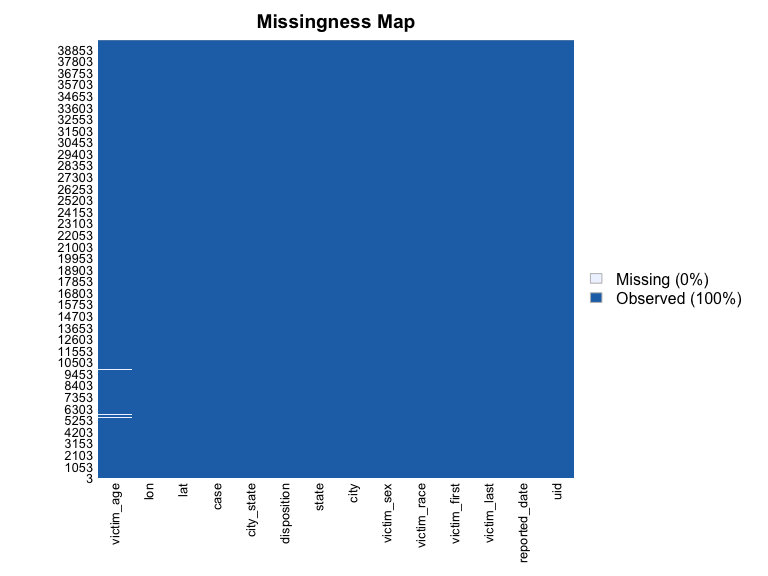
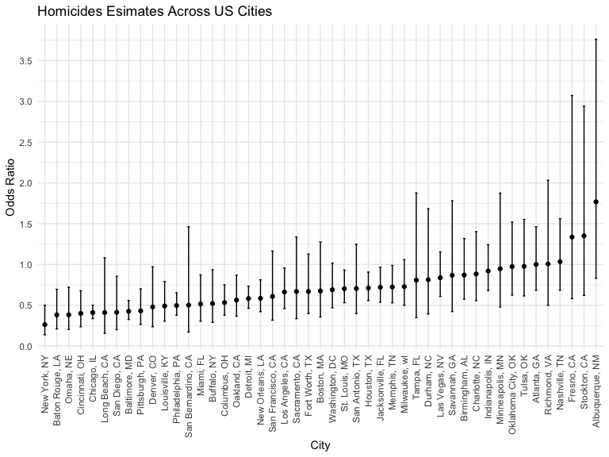

Homework 6
================
Mohammad Fouda

## Problem 2

### Data cleaning and tidying

``` r
homicide <-
  read_csv("data/homicide-data.csv") %>% 
  mutate(
      city_state = str_c(city, ", ", state),
      case = ifelse(disposition == "Closed by arrest", 1, 0),
      victim_age = as.numeric(victim_age),
      victim_race = fct_relevel(victim_race, "White", "Black"))%>% 
    filter(
        !(city_state %in% c("Dallas, TX", "Phoenix, AZ", "Kansas City, MO", "Tulsa, AL")),
        victim_race %in% c("White", "Black"))
```

    ## Rows: 52179 Columns: 12
    ## ── Column specification ────────────────────────────────────────────────────────
    ## Delimiter: ","
    ## chr (9): uid, victim_last, victim_first, victim_race, victim_age, victim_sex...
    ## dbl (3): reported_date, lat, lon
    ## 
    ## ℹ Use `spec()` to retrieve the full column specification for this data.
    ## ℹ Specify the column types or set `show_col_types = FALSE` to quiet this message.

### Regression for Baltimore, MD

## Plotting missing vs observed values

``` r
missing_plot <-
    homicide %>% 
    Amelia::missmap()
```



### Fitting the model

``` r
balt_df <-
    homicide %>% 
    filter(city_state == "Baltimore, MD") 

balt_model <-
    balt_df %>% 
    glm(case ~ victim_age + victim_sex + victim_race, family = binomial, data = .) %>% 
    broom::tidy()

balt_or <- 
    glm(case ~ victim_age + victim_sex + victim_race, family = binomial, data = balt_df) %>% 
    epiDisplay::logistic.display(simplified = TRUE) %>% 
    knitr::kable(digits = 2)

balt_or
```

\|\| \|\| \|\| \|\|

|                  |   OR | lower95ci | upper95ci | Pr(\>\|Z\|) |
|:-----------------|-----:|----------:|----------:|------------:|
| victim_age       | 0.99 |      0.99 |      1.00 |        0.04 |
| victim_sexMale   | 0.43 |      0.32 |      0.56 |        0.00 |
| victim_raceBlack | 0.43 |      0.31 |      0.61 |        0.00 |

\|\| \|\| \|\| \|\|

The odds ratio of for solving homicides comparing male victims to female
victims keeping all other variables fixed in Baltimore, MD is 0.43 and
the 95% confidence interval is 0.32 and 0.56.

## Regression across all cities

``` r
all_cities_model <-
    homicide %>% 
    nest(df = -city_state) %>% 
    mutate(
        models = map(.x = df, ~glm(case ~ victim_age + victim_sex + victim_race, family = binomial, data = .x)),
        results = map(models, broom::tidy)) %>% 
    select(city_state, results) %>% 
    unnest(results) %>% 
    filter(term == "victim_sexMale") %>% 
    mutate(
        or = exp(estimate),
        lower95ci = exp(estimate - 1.96*std.error),
        upper95ci = exp(estimate + 1.96*std.error),
        city_state = fct_reorder(city_state, or)) %>% 
    select(city_state, or, lower95ci, upper95ci) 

all_cities_model
```

    ## # A tibble: 47 × 4
    ##    city_state         or lower95ci upper95ci
    ##    <fct>           <dbl>     <dbl>     <dbl>
    ##  1 Albuquerque, NM 1.77      0.831     3.76 
    ##  2 Atlanta, GA     1.00      0.684     1.46 
    ##  3 Baltimore, MD   0.426     0.325     0.558
    ##  4 Baton Rouge, LA 0.381     0.209     0.695
    ##  5 Birmingham, AL  0.870     0.574     1.32 
    ##  6 Boston, MA      0.674     0.356     1.28 
    ##  7 Buffalo, NY     0.521     0.290     0.935
    ##  8 Charlotte, NC   0.884     0.557     1.40 
    ##  9 Chicago, IL     0.410     0.336     0.501
    ## 10 Cincinnati, OH  0.400     0.236     0.677
    ## # … with 37 more rows

### Plotting ORs and CI

``` r
model_plot <-
    all_cities_model %>% 
    ggplot(aes(x = city_state, y = or)) +
    geom_point() +
    geom_errorbar(aes(ymin = lower95ci, ymax = upper95ci), width = 0.2) +
      labs(
        title = "Homicides Esimates Across US Cities",
        x = "City",
        y = "Odds Ratio") + 
   theme(axis.text.x = element_text(angle = 90, vjust = 0.5, hjust=1)) +
    scale_y_continuous(breaks = seq(0, 5, by = 0.5))
    

model_plot
```



The plot shows that the odds of solving a homicide case of male victims
are lower compared to that of a female victim across most US cities with
the exception of Fresno, CA, stockton, CA, and Alberqueque, NM. The odds
are approximately similar in the cities of Minneapolis, MN, Oklahoma
City, OK, Tulsa, OK, Atlanta, GA, and Richmond, VA.
